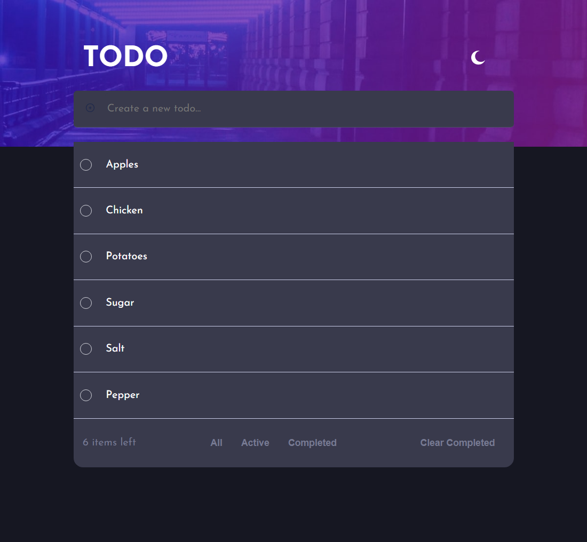
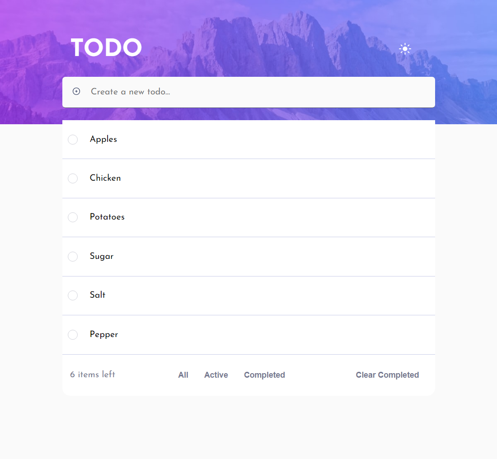
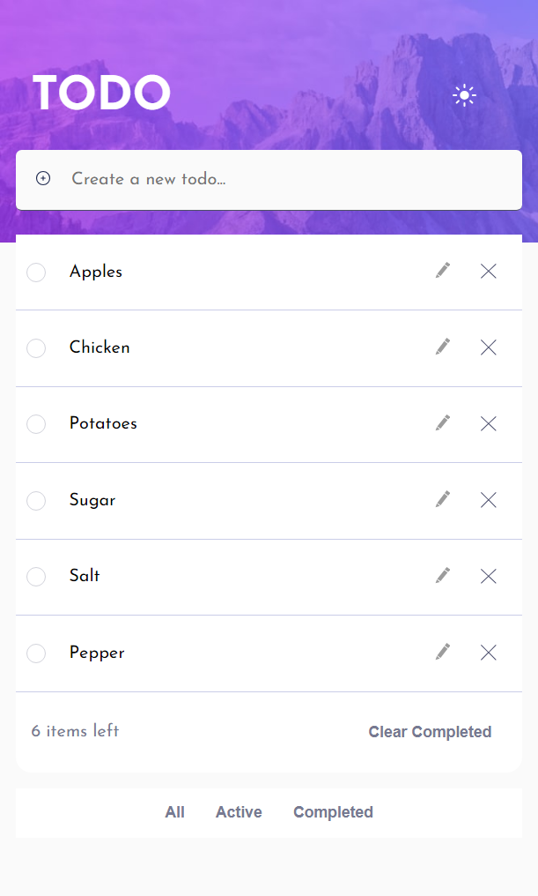
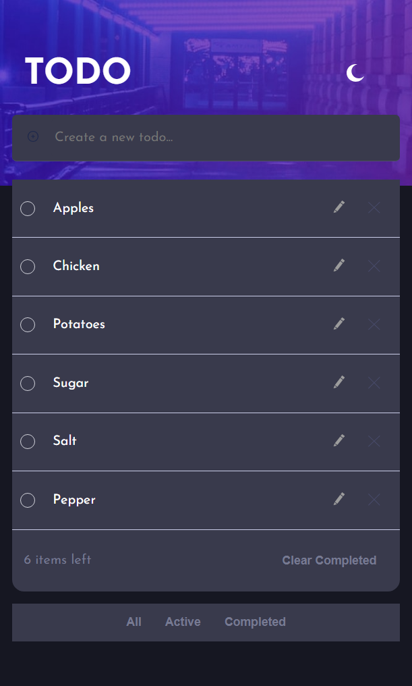

# Frontend Mentor - Todo app solution

This is a solution to the [Todo app challenge on Frontend Mentor](https://www.frontendmentor.io/challenges/todo-app-Su1_KokOW). Frontend Mentor challenges help you improve your coding skills by building realistic projects.

## Table of contents

- [Overview](#overview)
  - [The challenge](#the-challenge)
  - [Screenshot](#screenshot)
  - [Links](#links)
- [My process](#my-process)
  - [Built with](#built-with)
  - [What I learned](#what-i-learned)
  - [Continued development](#continued-development)
  - [Useful resources](#useful-resources)
- [Author](#author)

## Overview

### The challenge

Users should be able to:

- View the optimal layout for the app depending on their device's screen size ✔️
- See hover states for all interactive elements on the page ✔️
- Add new todos to the list ✔️
- Mark todos as complete ✔️
- Delete todos from the list ✔️
- Filter by all/active/complete todos ✔️
- Clear all completed todos ✔️
- Toggle light and dark mode ✔️
- **Bonus**: Drag and drop to reorder items on the list ❌
- **Bonus**: Be able to Edit Todo items ✔️

### Screenshot

- Desktop Screenshots
<p float="left">
  
   
</p>

- Mobile Screenshots
<p>
  
  
</p>

### Links

- Solution URL: [TODO App](https://github.com/ioangheraszim/Todo-App)
- Live Site URL: [Add live site URL here](https://your-live-site-url.com)

## My process

### Built with

- Semantic HTML5 markup
- CSS / SCSS custom properties
- Flexbox
- Mobile-first workflow
- [React](https://reactjs.org/) - JS library

### What I learned

Through working on this project, I've gained a deeper understanding of React's state management. One significant learning point was mastering CRUD (CREATE READ UPDATE DELETE) operations, which became evident as I developed this React TODO App.

To illustrate how I managed to filter active, completed, and all todo items within the list, I've provided a code snippet below. This code efficiently handles the categorization:

```js
  const filteredTodos = todos.filter((todo) => {
    if (filter === "all") {
      return true;
    } else if (filter === "active") {
      return !todo.completed;
    } else if (filter === "completed") {
      return todo.completed;
    }
    return true;
  });
```

By leveraging this code, I've successfully created a mechanism to filter the TODO list based on the selected category: "all," "active," or "completed." This code reflects my improved proficiency in React's core concepts and my ability to implement them in practical scenarios.

Another area where my understanding deepened was in using useEffect. By combining useEffect with localStorage, I successfully achieved the capability to save my todo list items directly in my web browser. This allowed me to maintain access to my todos even after refreshing or loading the page.

Here's a code snippet demonstrating how I implemented this functionality:

```js
  const saveToLocal = () => {
    localStorage.setItem('todos', JSON.stringify(todos))
  }

  const loadFromLocal = () => {
    const storedTodos = localStorage.getItem('todos')
    return storedTodos ? JSON.parse(storedTodos) : []
  }

  useEffect(() => {
    const loadedTodos = loadFromLocal();
    if (loadedTodos.length > 0) {
      setTodos(loadedTodos);
    }
  }, []);

  useEffect(() => {
    saveToLocal();
  }, [todos]);
```

Through this code, I established a mechanism to save and load todos from the browser's local storage. The two useEffect hooks serve distinct purposes: one for loading initial todos when the component mounts, and the other for updating the storage whenever the todos change. This demonstrates my newfound grasp of efficiently managing state using useEffect and leveraging browser storage for data persistence.

### Continued development

Looking ahead, I'm excited about the ongoing development journey. I plan to enhance my Javascript and React skills by delving into more projects that make use of React hooks and dive deeper into essential Javascript concepts. This hands-on approach will undoubtedly help solidify my proficiency in these areas and empower me to tackle even more complex challenges.

### Useful resources

- [Youtube Web Dev Simplified](https://www.youtube.com/watch?v=Rh3tobg7hEo&t=1738s&ab_channel=WebDevSimplified) - The approach I encountered resonated well with me, and I intend to adopt this pattern in my future endeavors. It's evident that this pattern aligns with best practices, and I look forward to incorporating it into my ongoing work.

## Author

- Website - [Ioan Gheraszim](https://github.com/ioangheraszim)
- Frontend Mentor - [@ioangheraszim](https://www.frontendmentor.io/profile/ioangheraszim)
